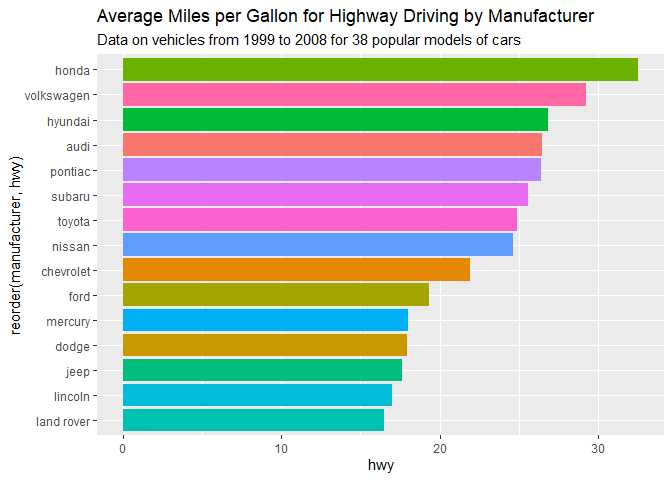

First R Markdown in Git.
================
Oliver Souliere
2025-04-15

## R Markdown

This is an RMD file altered by Oliver Souliere

When you click the **Knit** button a document will be generated that
includes both content as well as the output of any embedded R code
chunks within the document. You can embed an R code chunk like this:

``` r
a <- 88
b <- 99
c <- a+b
print(c)
```

    ## [1] 187

## Including Plots

You can also embed plots, for example:

``` r
avgmpgdata <- mpg %>% 
  group_by(manufacturer) %>% 
  summarize(hwy = mean(hwy), cty = mean(cty))

g <- ggplot(data = avgmpgdata)
g + geom_col(aes(x = hwy, y = reorder(manufacturer, hwy), fill = manufacturer)) +
  ggtitle("Average Miles per Gallon for Highway Driving by Manufacturer", subtitle = "Data on vehicles from 1999 to 2008 for 38 popular models of cars") +
  theme(legend.position="none") 
```

<!-- -->
